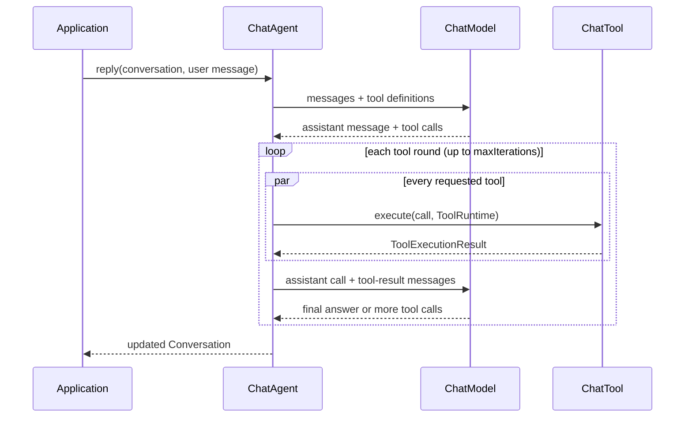
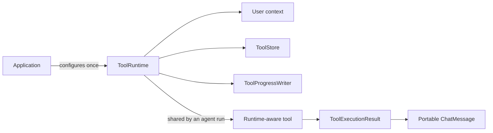
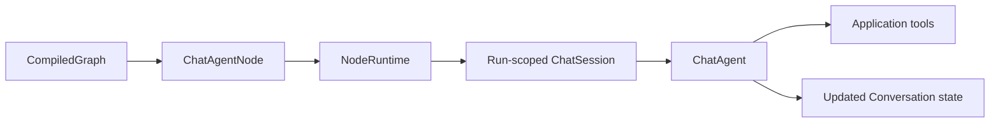

# Agent and tool flow

`ChatAgent` owns the model/tool loop. Provider adapters only translate portable messages to and from a provider protocol; they never execute application tools.

## Runtime ownership

`ToolStore` is an application boundary: `InMemoryToolStore` is suitable for examples and tests, while production callers provide a durable implementation. `ToolExecutionResult` can contain text, image, audio, or document blocks. Provider-specific wire mappings remain separate adapter work.

## Graph integration

The graph runtime stays independent from chat. `cortavyn-chat` supplies `ChatAgentNode`, which adapts a graph-state `Conversation` to a run-scoped `ChatSession`. The session factory receives `NodeRuntime`, so applications can construct a `ToolRuntime` with the graph's `runId` and forward tool progress into their own observability pipeline.

